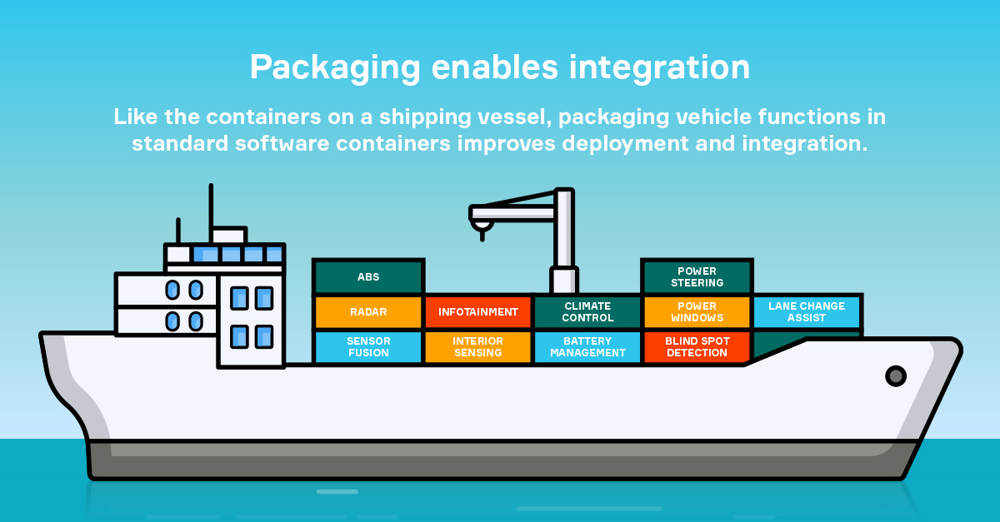
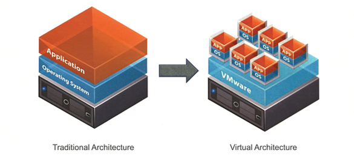
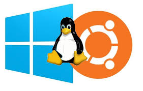
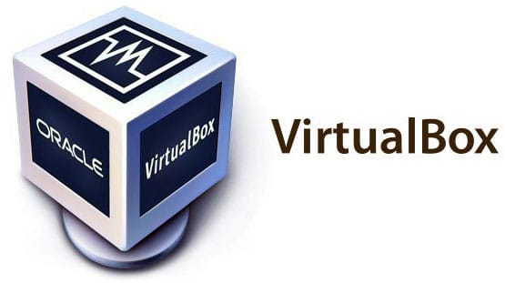
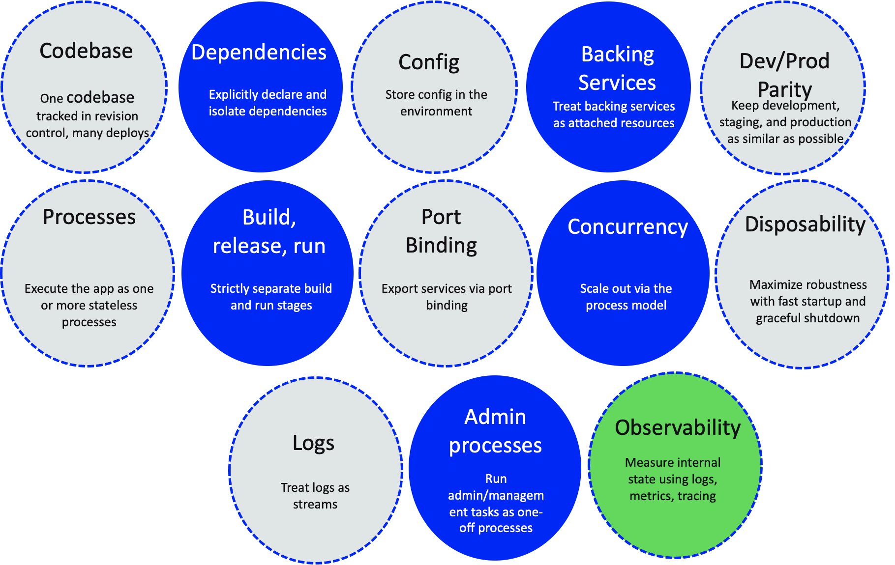

# Student Guide to Software Development

### Welcome to Software Development!

This site serves as a comprehensive guide to key topics in modern software development, including Containerization, Virtualization, Docker, and Kubernetes. We'll explore how each of these technologies functions and how they play a critical role in the software development process. Whether you're new to development or looking to expand your skills, this guide will serve as a helpful source of information.

## Introduction to Containers

Containerization packages applications along with their dependencies into isolated environments called containers. This ensures consistency across different computing environments. Containers make software portable, reliable, and easier to manage. Think of it like packing everything you need for a picnic into one basket so nothing is forgotten when you move locations. 

Containerization, using tools like **Docker** and **Kubernetes**, simplifies the development and deployment of applications. It ensures portability, scalability, and consistency, making it a must-know technology for modern software development.

### Learn more about Containerization below:

[Containerization](https://github.com/cr432/is373guide/wiki/Containerization)

### What containerization tool is right for me?

[Docker vs Kubernetes](https://github.com/cr432/is373guide/wiki/Docker-vs-Kubernetes)

### Helpful Links
- [Docker Commands](https://github.com/cr432/is373guide/blob/development/dockercommands.md)

## Introduction to Virtualization

Virtualization creates virtual versions of physical hardware like servers, storage, and networks. This allows multiple operating systems to run on a single physical machine, making better use of resources. Virtual machines (VMs) are like independent computers running within one host. Think of it like dividing a large plot of land into smaller gardens, where each garden can grow its own plants without affecting the others.

Virtualization, using tools like **VirtualBox** and **VMware**, allows multiple operating systems to run on a single physical machine. It provides flexibility, resource optimization, and isolation between environments, making it an essential technology for testing, development, and infrastructure management.

### Learn more about Virtualization below:

[Virtualization](https://github.com/cr432/is373guide/blob/development/virtualization.md)

### Learn more about WSL2 below:

[WSL2](https://github.com/cr432/is373guide/wiki/WSL2)

### Learn more about VirtualBox below:

[VirtualBox](https://github.com/cr432/is373guide/wiki/VirtualBox)

## Introduction to Twelve Factor App

## Introduction to Kernels

The kernel is the core component of an operating system that manages hardware resources and allows software to communicate with the hardware. It handles tasks like memory management, process control, and device interaction, making it crucial for system stability and performance. Think of it as the bridge between the computer's hardware and its applications.

### Learn more about kernels below:

[Kernels](https://github.com/cr432/is373guide/blob/development/kernel.md)

---
